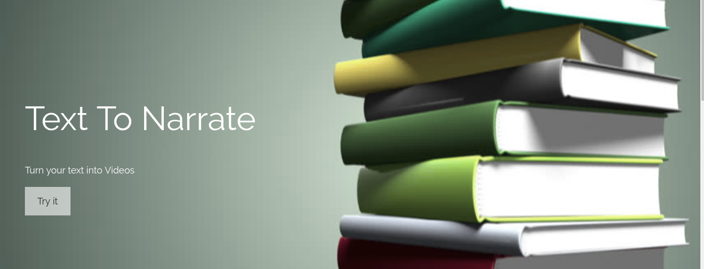
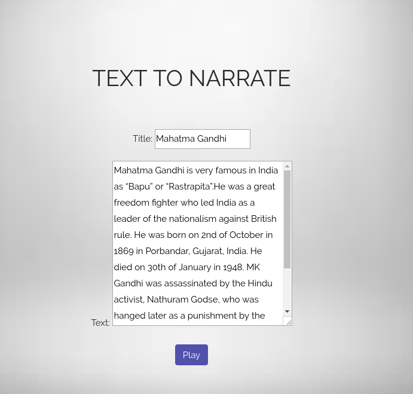
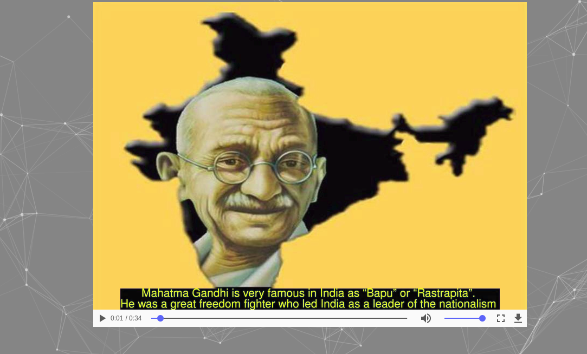

# Text To Narrate

It is a django app which takes in input a text exerpt and shows the narrated film of that text with relevant images.

## Dependencies

* Tensorflow
* keras
* Imagemagick
* moviepy

## Deep Learnig Models Used

NER model is trained using CONNL-2003 dataset and Glove Embeddings.
Tacotron model is used.

## Output Sample

