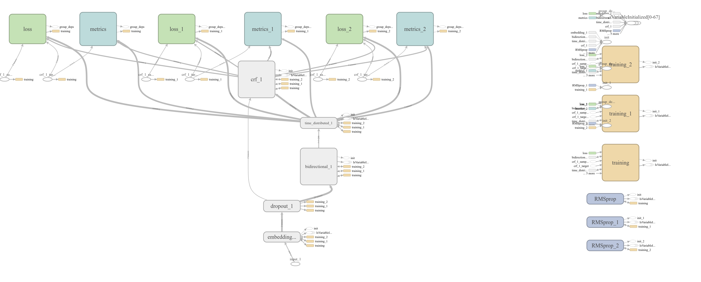

# Text To Narrate

## Overview

It is a django app which takes in input a text exerpt and shows the narrated film of that text with relevant images.It uses Named Entitiy Recognition to extract entites from the given text. Then Images of those entities are downloaded from google. Then google Tachotron model is used to create audio of given text. Then using Images, Text and audio the final Video is generated.

## Dataset 

The dataset used  is [Annotated Corpus for Named Entity RecognitionCorpus (CoNLL 2002) annotated with IOB and POS tags](https://www.kaggle.com/abhinavwalia95/entity-annotated-corpus/data). The dataset consists 47959 sentences having 1048575 words with labels. The labels contain POS(position of word in sentence ) and Tag(Name, Orginisation, Location etc). 

## NLP Model

NER model is trained using CONNL-2003 dataset and Glove Embeddings.We have tried two models.The training code is included in training folder.

### Model 1
-  input_1 (InputLayer)            
-  Embedding_1 (Embedding)     
-  Dropout_1 (Dropout Layer)         
-  Bidirectional_1 (Bidirection LSTM ) 
-  Time_distributed_1 (TimeDistributed LSTM)     
-  Crf_1 (CRF)                  

Model 1 has word embedding created from our dictionary. 

### Model 2

Model 2 has glove pretrained embeddings as well as the embeddings created from our dictionary.

For final App Model 2 is used.

## Tensorboard Visual 

To view properly download it and zoom it.

## Django UI

### Text Input

### Video Output

## Instruction for running app
1. Install all the requirements from requirement.txt
2. Clone the repository and use 'python manage.py runserver' to run it on localhost.
